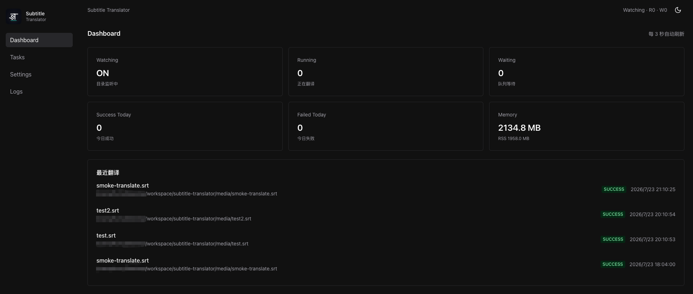
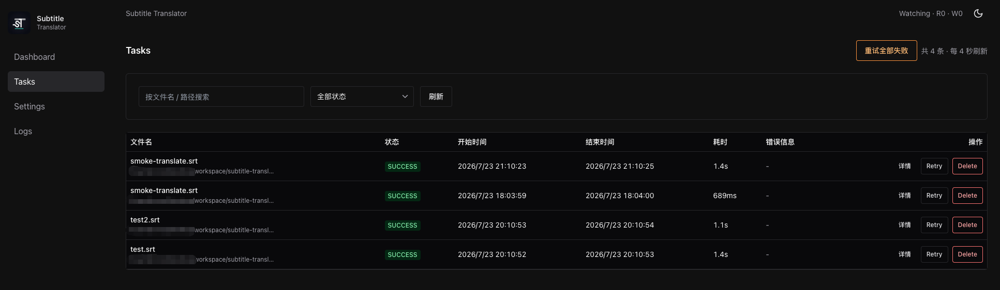
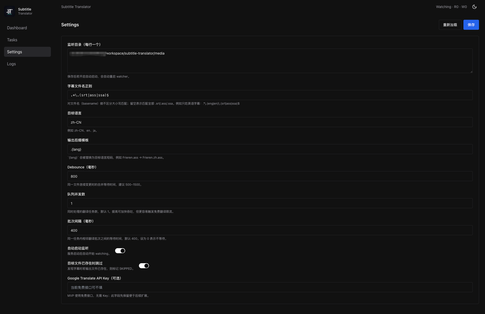
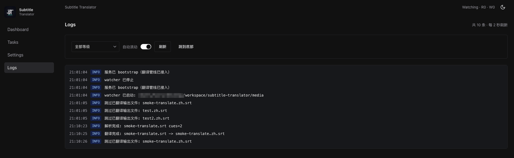

# Subtitle Translator

类似 Sonarr / Radarr 的**字幕自动翻译后台服务**：长期监听指定目录，发现新字幕后自动翻译并写出目标文件，同时提供现代化 Web 管理界面查看状态、任务、配置与日志。



> 截图中 Memory 偏高，是因为当时为本地开发环境（Next.js + Webpack 热更新会额外占内存），并非生产 Docker 部署的常态；用 `docker compose` / GHCR 镜像运行后会低很多。

## 它解决什么问题

看剧、整理片库时，字幕经常只有英文字幕。本服务把「丢进目录 → 自动翻译 → 生成带语言后缀的文件」变成无人值守流程，适合挂在 NAS / 服务器上长期跑。

典型结果：

```text
Frieren.ass      →  Frieren.zh.ass
movie.eng.srt    →  movie.eng.zh.srt
```

默认不会覆盖原文件；若目标已存在，可配置为跳过。

## 功能概览

- **目录监听**：chokidar 监听配置目录，文件写入稳定后自动入队
- **字幕格式**：支持 `.srt` / `.ass` / `.ssa`，可用正则进一步过滤文件名
- **批量翻译**：默认 Google 机器翻译（免费接口或 Cloud Translation）；可选启用 **OpenAI 兼容 LLM** 优先翻译，失败时可回退机器翻译（可仅失败窗口回退）；带限流重试与可配置并发/间隔、上下文窗口
- **容错重试**：网络/限流错误可配置重试次数；遇 Google 限流或风控时还能自动缩小上下文窗口后重试
- **任务管理**：查看详情、单条 Retry、一键重试全部失败任务
- **Web 后台**：Dashboard / Tasks / Settings / Logs，深色主题

| Dashboard                          | Tasks                      |
| ---------------------------------- | -------------------------- |
|  |  |

| Settings                         | Logs                     |
| -------------------------------- | ------------------------ |
|  |  |

### 管理界面

- **Dashboard**：监听状态、运行/等待队列、今日成功失败、内存占用、最近翻译
- **Tasks**：按文件名/路径与状态筛选，详情 / Retry / Delete，支持「重试全部失败」
- **Settings**：基础 / 机器翻译 / 大语言模型分卡配置（目录、语言、Google Key、LLM Base URL 等）
- **Logs**：实时日志流，按等级过滤

## 技术栈

- Next.js (App Router) + TypeScript
- Chakra UI v3 + Tailwind CSS
- Prisma + SQLite（better-sqlite3）
- chokidar（目录监听）
- google-translate-api-x（免费 Google Translate；配置 API Key 后改走 Cloud Translation v2）
- 内存任务队列（可配置并发）
- Docker / GHCR 自动构建

镜像地址：`ghcr.io/hurryhuang1007/subtitle-translator`

## 本地开发

```bash
pnpm install
cp .env.example .env
pnpm db:migrate
pnpm dev
```

打开 [http://localhost:3000](http://localhost:3000)。

默认监听目录为项目下的 `media/`，放入字幕文件即可触发翻译。

## 部署

### 方式一：拉取预构建镜像（推荐）

`main` 分支推送后会自动发布 `latest`；打 `v*` 标签会额外发布语义化版本（如 `1.0.0`）。

```bash
mkdir -p media data logs

# 首次若镜像为私有，先登录 GHCR（公开包可跳过）
# echo YOUR_GITHUB_TOKEN | docker login ghcr.io -u YOUR_GITHUB_USERNAME --password-stdin

docker pull ghcr.io/hurryhuang1007/subtitle-translator:latest

docker run -d \
  --name subtitle-translator \
  --restart unless-stopped \
  -p 3000:3000 \
  -v "$PWD/media:/media" \
  -v "$PWD/data:/app/data" \
  -v "$PWD/logs:/app/logs" \
  ghcr.io/hurryhuang1007/subtitle-translator:latest
```

或使用 Compose（默认拉取 GHCR 镜像；加 `--build` 则本地构建）：

```bash
# 可选：指定宿主机字幕目录
# export MEDIA_PATH=/path/to/your/media

docker compose up -d
# 本地构建：docker compose up -d --build
```

服务地址：[http://localhost:3000](http://localhost:3000)

### 方式二：本地构建镜像

```bash
docker compose up -d --build
```

### 卷映射

| 容器路径    | 默认宿主机 | 用途          |
| ----------- | ---------- | ------------- |
| `/media`    | `./media`  | 字幕监听目录  |
| `/app/data` | `./data`   | SQLite 数据库 |
| `/app/logs` | `./logs`   | 应用日志      |

可通过环境变量覆盖：

```bash
MEDIA_PATH=/mnt/media DATA_PATH=./data LOGS_PATH=./logs docker compose up -d
```

### 镜像标签

| 标签            | 来源                  |
| --------------- | --------------------- |
| `latest`        | 推送到默认分支 `main` |
| `sha-<commit>`  | 每次构建对应的短 SHA  |
| `1.2.3` / `1.2` | 推送 git tag `v1.2.3` |

### 常用命令

```bash
docker compose logs -f
docker compose pull && docker compose up -d
docker compose down
```

### GitHub Actions

工作流文件：`.github/workflows/docker-publish.yml`

触发条件：

- push 到 `main`
- push `v*` tag
- 手动 `workflow_dispatch`

产物推送到：`ghcr.io/hurryhuang1007/subtitle-translator`

若拉取失败，到仓库 **Packages** 将包可见性设为 Public，或确保 Actions 的 Workflow permissions 允许读写 packages。

## 目录约定

源码在 `src/` 下，路径别名 `@` → `src`：

| 目录       | 用途               |
| ---------- | ------------------ |
| `app/`     | 页面路由           |
| `server/`  | 监听 / 解析 / 翻译 |
| `com/`     | 通用组件           |
| `service/` | 前端 API 封装      |
| `store/`   | 全局 MobX store    |
| `util/`    | 工具函数           |

截图资源放在 `readme/`。

## 常用脚本

```bash
pnpm dev             # 开发
pnpm lint            # 日常校验
pnpm build           # 生产构建
pnpm db:migrate      # 开发迁移
pnpm db:deploy       # 生产迁移
pnpm test:parser     # 解析器测试
pnpm smoke:translate # 翻译冒烟测试
```

## 说明

翻译优先级：

1. 若 Settings 启用 LLM，并填写了 OpenAI 兼容的 Base URL / API Key / 模型 → 走大模型翻译
2. 否则（或 LLM 失败且开启「回退机器翻译」）→ Google Cloud Translation（有 Key）或免费网页接口
   - 同时开启「仅失败窗口回退机器翻译」（默认开）时：只对失败窗口用机器翻译，后续窗口继续 LLM
   - 关闭「仅失败窗口回退」时：整文件用机器翻译重跑

机器翻译与 LLM 各自有独立的「一次窗口大小 / 最多上文 / 单次最大窗口字符数量」配置。字符上限默认分别为 `4500` 和 `1500`：达到上限时优先保留本次待翻译正文，并用剩余额度自动缩减上文。LLM 默认窗口 30、上文 5；可选「影片类型」（含自定义）会向提示词注入场景说明（不选择则不注入）；请求 LLM 时还会按「输出上限倍数」（默认 3）设置 `max_tokens = 输入字符数 × 倍数`。

### 网络错误重试

机器翻译与 LLM 遇到网络异常、限流、网关错误等**可重试**错误时，会按指数退避自动重试。

- Settings → 机器翻译 →「网络重试次数」，默认 `5`（不含首次请求，范围 `0–30`）
- Settings → 大语言模型 →「网络重试次数」，默认 `5`（不含首次请求，范围 `0–30`）
- 仅对可重试错误生效；解析错误、参数错误等不会重试

### 缩窗重试（限流 / 风控）

启用「对白上下文合并」时，若免费 Google 接口返回限流或风控类错误（如 `Partial Translation Request Fail`、`429`），可自动将上下文窗口与上文句数**减半后重试**，直至成功或达到下限/次数上限。

| 配置项         | 默认 | 说明                     |
| -------------- | ---- | ------------------------ |
| 限流时缩窗重试 | 开   | 功能开关                 |
| 缩窗重试次数   | 3    | 单次任务内最多缩窗几次   |
| 窗口下限（句） | 100  | 缩窗后窗口大小不低于此值 |
| 上文下限（句） | 30   | 缩窗后上文句数不低于此值 |

例：窗口/上文从 `500 / 100` 依次缩为 `250 / 50 → 125 / 30 → 100 / 30`。缩窗与网络重试是两层：先按网络重试次数在当前窗口重试，仍失败且判定为限流/风控时再缩窗。

## License

本项目采用 [MIT License](./LICENSE) 开源。
